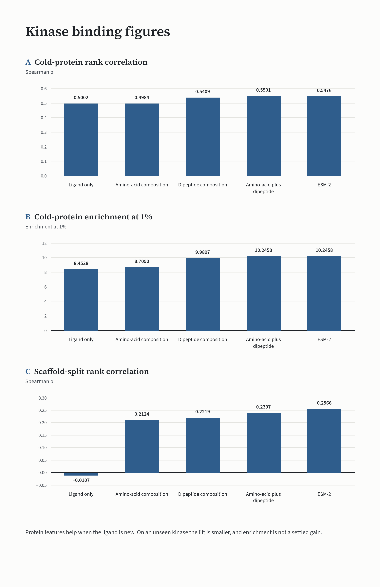

# Ranking Public Kinase-Ligand Affinities With and Without Protein Features

Sofia Lindelow

2026-10-03

## Abstract

A score for one protein-ligand pair was tested for whether it can order a public compound library for one kinase, and for whether that order uses the protein or only the ligand. Labels on the primary set are experimental dissociation constants, converted to pKd, with a binder defined as pKd of at least 7. The working score is a histogram gradient booster on Morgan fingerprints, with amino-acid composition plus dipeptide composition as the protein features that improved the cold-protein comparison. On the saved splits, those protein features beat a ligand-only control when scaffolds are held out, and they add a smaller lift when whole proteins are held out (cold-protein Spearman rho 0.5501 versus 0.5002; enrichment at 1% 10.2458 versus 8.4528). A kinase-cluster interval for the Spearman difference excludes 0. The interval for the enrichment difference includes 0. A directed message-passing graph model did not keep that cold-protein lift. The same composition features transferred to a secondary KIBA set on Spearman rho, and not on enrichment at 1%. A one-pair selectivity comparison of SRC and LCK was positive, and the ligand-only difference was constant. An 8068-molecule library ranked for LCK recovered known binders far above chance, but LCK was not held out of training. Holding out SLK left recovery above chance, and the ligand-only score won the broader ranks. These are predicted scores on public labels. They are not wet-lab hits.

## Introduction

A protein-ligand affinity score is a number assigned to one protein sequence and one molecule so that molecules can be ordered for a named kinase. On the primary labels the number is trained against pKd, defined as 9 minus the base-10 logarithm of the dissociation constant in nanomolar. A binder, used only for enrichment and discrimination, is a pair with pKd of at least 7, which is a dissociation constant of at most 100 nM. The score is a prediction. It is not a new measurement.

Kinase panels of this kind reuse a small set of ligands across many targets (Davis et al., 2011; Huang et al., 2021). A ligand-only score can then look strong on an unseen kinase, because the chemotypes are not new. The gap is not whether a rank can be produced. The gap is whether a protein feature changes the rank once the ligand is allowed to explain it.

The comparison is the protein-feature score against the same model with protein features removed, on the same rows. Two holdouts define that comparison. A scaffold holdout removes Murcko scaffolds. A cold-protein holdout removes entire proteins. Ranking is the estimand: Spearman rho of the score against the continuous label, and enrichment of binders in the top 1% and top 5% of the ranked list. Area under the receiver operating characteristic curve (AUROC) at the binder cut is secondary. Calibration asks a different question, whether a mapped probability matches the observed binder rate, and it is not allowed to stand in for rank.

The analysis does not claim a wet-lab hit, a new binder, or a prospective screen. No molecule is treated as active unless an experiment already labeled it. An external concordance check against an outside assay list was not run. A cold protein is not a cold ligand, because the same ligands remain labeled on other kinases. Metrics on the kinase inhibitor bioactivity (KIBA) score are not pKd metrics.

The aims are:

1. Test whether protein features improve Spearman rho and enrichment relative to a ligand-only score on scaffold and cold-protein splits of the primary set.
2. Test whether a graph encoder keeps a cold-protein lift when composition features are added.
3. Test whether the composition lift transfers to KIBA score under the same two holdouts.
4. Test whether mapping the score to a binder probability is calibrated, and whether that mapping changes rank.
5. Test whether the score ranks selectivity for one held-out kinase pair.
6. Test whether a library ranking recovers known binders above chance when the kinase was seen in training, and when the kinase was fully held out.

## Methods

### Data

The primary table is the DAVIS kinase panel as distributed by Therapeutics Data Commons (Huang et al., 2021), from the measurements in Davis et al. (2011). The frozen table contains 25,772 pairs, 68 ligands, and 379 targets. Kd in that table is in nanomolar. pKd uses the definition above. The binder cut was fixed before later comparisons and was not changed.

The secondary table is KIBA (Tang et al., 2014). The Therapeutics Data Commons file was not retrieved (HTTP 403). Pairs were taken from the public mirror distributed with DeepDTA (Öztürk et al., 2018). The frozen KIBA table contains 118,254 pairs, 2,068 ligands, and 229 targets. The label is the KIBA score. It is not pKd. A KIBA binder is a score of at least 12.1. The primary split files were not altered for this table.

The library is not a training label set. It is a diverse Murcko subsample of 8,000 molecules from the MoleculeNet HIV table, drawn with seed 42, plus the 68 primary ligands spiked in so that recovery of known binders can be counted. The library has 8,068 molecules and 7,582 unique Murcko scaffolds. HIV activity labels were not used. The same library was reused for the held-out kinase. It was not rebuilt.

### Splits and what was held out

Splits aim at about 20% test and about 10% validation, with seed 42. Split membership was written once and reloaded. It was not redrawn for later fits.

The scaffold test set has 5,306 pairs and 302 binders. The cold-protein test set has 5,168 pairs and 388 binders. The scaffold split exports 17,813 training pairs and 2,653 validation pairs. The cold-protein split exports 18,020 training pairs and 2,584 validation pairs. Those counts are in artifacts/metrics_v1.2.json (n_train, n_val, and n_test under train_info). artifacts/metrics.json and artifacts/metrics_v1.1.json export the same n_train and n_test. Later fits that state a training size are listed here.

| Comparison | Rows used to fit the score | Held out of that fit |
|---|---|---|
| Scaffold and cold-protein ranking | The saved scaffold split, and, separately, the saved cold-protein split | Test scaffolds, or test proteins. Validation rows stay inside the split. |
| Calibration | No new fit of the ranker. An isotonic map only. | Histogram models: isotonic fit on validation, scored on test. Graph model: validation scores were not saved, so the isotonic fit uses a 30% holdout of the test set. |
| KIBA | New scaffold and cold-protein splits on KIBA only, same fraction and seed | Primary splits unchanged |
| Selectivity | All primary pairs except SRC and LCK (25,636 training pairs) | Both kinases together |
| Library rank for LCK | Scaffold training and validation rows (20,466 pairs) | Scaffold test rows were not used. LCK itself was not held out. |
| Library rank for SLK | All primary pairs except the 68 SLK pairs (25,704 training pairs) | SLK only. The same 68 ligands still have labels on other kinases. |

Library scores come from those separate fits. They are not the test-set models from the pair-ranking comparisons.

SLK was chosen before any library score was read. LCK was excluded. Target identifiers containing a parenthesis were dropped. A kinase needed at least 10 binders at pKd of at least 7. The binder count closest to LCK (17) was kept, with more binders and then the identifier as the tie break. Thirty kinases were eligible. SLK has 17 binders. The runners-up by that rule were GAK (16), LOK (19), DDR2 (15), VEGFR2 (15), and FLT1 (20). Those runners-up were not scored.

### Features and models

Ligand features for the histogram model are Morgan fingerprints, radius 2, 2,048 bits, the extended-connectivity fingerprint (ECFP) of Rogers and Hahn (2010). Protein features are concatenated to that fingerprint.

| Protein features | Definition | Dimension, including the fingerprint |
|---|---|---:|
| None (ligand-only) | Fingerprint only | 2048 |
| Amino-acid composition | Frequencies of the 20 amino acids | 2068 |
| Dipeptide composition | Dipeptide frequencies | 2448 |
| Amino-acid plus dipeptide composition | Both composition vectors | 2468 |
| ESM-2 | Frozen ESM-2 model esm2_t6_8M_UR50D (Lin et al., 2023), mean pooled, 320 dimensions, sequences truncated at 1,022 residues | 2368 |

Amino-acid composition can be computed for an unseen sequence. A target-identifier code cannot. Dipeptide composition and the joint composition vector were compared with amino-acid composition and with ESM-2 on the same splits and the same booster. The joint composition vector was the protein representation used for the graph-model comparison, the selectivity comparison, and both library rankings. ESM-2 was not an extra input to the graph model. ESM-2 was not applied to the library.

The histogram model is scikit-learn HistGradientBoostingRegressor (scikit-learn 1.5.2), a histogram-based gradient booster in the sense described by Ke et al. (2017). Locked settings were maximum iterations 200, learning rate 0.08, maximum depth 8, minimum samples per leaf 20, L2 regularization 0.1, early stopping on, validation fraction 0.1, 15 iterations with no change, and random state 42. RDKit 2024.3.5 computed the fingerprints. The ESM-2 run used fair-esm 2.0.0.

The graph model is Chemprop 2.2.1, a directed message-passing neural network (Yang et al., 2019). Settings were 15 epochs, batch size 64, hidden size 300, depth 3, dropout 0, warmup of 2 epochs, initial, maximum, and final learning rates 0.0001, 0.001, and 0.0001, early-stopping patience 5, CPU, and seed 42. When protein features were used, the joint composition vector was passed as an extra descriptor. The histogram model was not refit for that comparison.

### Metrics

Pair ranking uses Spearman rho, enrichment at 1%, enrichment at 5%, and AUROC. Enrichment is the binder rate in the top slice divided by the binder rate in the test list.

Calibration uses expected calibration error (ECE) in 10 bins, and Brier score, before and after isotonic regression. AUROC is reported again. An unchanged AUROC is the check that the map did not reorder pairs. The graph-model ECE after isotonic regression is not an unbiased test number, because the map was fit on a slice of the test set.

Selectivity uses the difference score(SRC) minus score(LCK), and the same difference on true pKd. A selective ligand has an absolute pKd difference of at least 1. Enrichment of those ligands is computed at 5%, 10%, and 20% of the 68 ligands, ranked by the absolute predicted difference.

Library recovery is the fraction of known binders for that kinase (pKd of at least 7) inside the top 1% and inside the top 500, plus the mean rank. The top 1% uses rank 81, because that is the ceiling of 1% of 8,068. Random expected counts and a random mean rank are analytic baselines. They are not a second model.

Saved scores were resampled with replacement (1,000 draws, seed 42): paired rows for Spearman rho and for the difference in Spearman rho (protein score minus ligand-only score), and library rows for the SLK recovery differences, with a percentile 95% interval and a two-sided recentered bootstrap p-value (plus-one correction) for a difference of zero. The cold-protein histogram comparison resamples the 76 held-out kinases instead of pairs. Every test pair of a drawn kinase is kept, and each of those kinases contributes the same 68 ligands. Those scores were read from the saved models and were not refit.

## Results

### Protein features on scaffold and cold-protein splits

Amino-acid composition, dipeptide composition, the joint composition vector, and ESM-2 were compared with a ligand-only fingerprint on the saved splits. The amino-acid rows are identical to an earlier fit on those same splits.

| Split | Protein features | Spearman rho | EF at 1% | EF at 5% | AUROC | n test | n binders |
|---|---|---:|---:|---:|---:|---:|---:|
| Scaffold | None | -0.0107 | 0.0000 | 0.1982 | 0.4413 | 5306 | 302 |
| Scaffold | Amino-acid composition | 0.2124 | 6.5072 | 3.3025 | 0.6276 | 5306 | 302 |
| Scaffold | Dipeptide composition | 0.2219 | 4.8804 | 3.5007 | 0.6341 | 5306 | 302 |
| Scaffold | Amino-acid plus dipeptide | 0.2397 | 5.2058 | 3.6328 | 0.6437 | 5306 | 302 |
| Scaffold | ESM-2 | 0.2566 | 5.8565 | 4.0952 | 0.6702 | 5306 | 302 |
| Cold protein | None | 0.5002 | 8.4528 | 6.5312 | 0.8280 | 5168 | 388 |
| Cold protein | Amino-acid composition | 0.4984 | 8.7090 | 6.1712 | 0.8352 | 5168 | 388 |
| Cold protein | Dipeptide composition | 0.5409 | 9.9897 | 7.1484 | 0.8652 | 5168 | 388 |
| Cold protein | Amino-acid plus dipeptide | 0.5501 | 10.2458 | 6.9941 | 0.8689 | 5168 | 388 |
| Cold protein | ESM-2 | 0.5476 | 10.2458 | 7.4055 | 0.8783 | 5168 | 388 |

On the scaffold split, the ligand-only score does not rank. Spearman rho is -0.0107. Enrichment at 1% is 0. Every protein representation beats that control on Spearman rho and on AUROC. ESM-2 has the highest scaffold Spearman rho (0.2566) and the highest scaffold AUROC (0.6702).

On the cold-protein split, amino-acid composition does not beat the ligand-only score. Spearman rho is 0.4984 versus 0.5002. Enrichment at 1% is slightly higher (8.7090 versus 8.4528). Enrichment at 5% is slightly lower (6.1712 versus 6.5312). Cold-protein ranking with amino-acid composition alone is ligand-driven.

Dipeptide composition carries most of the cold-protein lift (Spearman rho 0.5409). The joint composition vector is the best cold-protein Spearman rho in the table (0.5501 versus 0.5002). The exported difference is 0.0500. Enrichment at 1% is 10.2458 versus 8.4528. Enrichment at 5% is 6.9941 versus 6.5312. A pre-stated rule counted a pass when the Spearman difference was at least 0.05 or enrichment showed a clear lift. The enrichment part of that rule was met. The strict Spearman part was recorded as not met.

Per-pair histogram scores for that comparison were saved from the fitted models, without a refit. A kinase-cluster bootstrap redrew the 76 held-out kinases with replacement (1,000 draws, seed 42) and recomputed both scores on the pairs belonging to the drawn kinases. The Spearman difference is 0.0500 (95% interval 0.0271 to 0.0720; two-sided p = 0.001). That interval excludes 0. The enrichment-at-1% difference is 1.7930 (95% interval -0.2624 to 3.2468; two-sided p = 0.091). That interval includes 0. The joint composition vector was the best Spearman among four feature modes on this same split, and ESM-2 was essentially tied with it. The interval is not adjusted for those other modes.

ESM-2 is close on the cold-protein split (Spearman rho 0.5476). Enrichment at 1% matches the joint composition vector (10.2458). Enrichment at 5% is higher (7.4055). AUROC is higher (0.8783). The joint composition vector was retained for later comparisons because it had the best inexpensive cold-protein Spearman rho, matched ESM-2 on enrichment at 1%, and does not require an embedding model at training time.

### Graph encoder

The graph model was trained on the same primary freeze and the same split files. The histogram rows below are the composition comparison already reported. They were not refit.

| Split | Model | Spearman rho | EF at 1% | EF at 5% | AUROC | n test | n binders |
|---|---|---:|---:|---:|---:|---:|---:|
| Scaffold | Graph, ligand-only | 0.2621 | 0.3254 | 0.5284 | 0.6645 | 5306 | 302 |
| Scaffold | Graph plus joint composition | 0.3176 | 7.4833 | 4.5575 | 0.7373 | 5306 | 302 |
| Cold protein | Graph, ligand-only | 0.4997 | 8.7090 | 6.6341 | 0.8279 | 5168 | 388 |
| Cold protein | Graph plus joint composition | 0.4895 | 8.4528 | 5.9655 | 0.8541 | 5168 | 388 |
| Scaffold | Histogram, ligand-only | -0.0107 | 0.0000 | 0.1982 | 0.4413 | 5306 | 302 |
| Scaffold | Histogram plus joint composition | 0.2397 | 5.2058 | 3.6328 | 0.6437 | 5306 | 302 |
| Cold protein | Histogram, ligand-only | 0.5002 | 8.4528 | 6.5312 | 0.8280 | 5168 | 388 |
| Cold protein | Histogram plus joint composition | 0.5501 | 10.2458 | 6.9941 | 0.8689 | 5168 | 388 |

On the cold-protein split, adding the joint composition vector to the graph model does not help. Spearman rho is 0.4895 versus 0.4997 for the graph ligand-only score (difference -0.0102). Enrichment at 1% is 8.4528 versus 8.7090 (difference -0.2561). Enrichment at 5% is 5.9655 versus 6.6341 (difference -0.6686). Against the histogram model with the same protein features, the graph model is lower on cold-protein Spearman rho (0.4895 versus 0.5501, difference -0.0606).

On the saved graph-model scores for that split, the paired bootstrap puts the protein Spearman rho at 0.4895 (95% interval 0.4683 to 0.5113) and the ligand-only Spearman rho at 0.4997 (95% interval 0.4794 to 0.5196). The difference, protein minus ligand-only, is -0.0102 (95% interval -0.0304 to 0.0104; two-sided p = 0.3586). That interval includes 0.

The graph ligand-only score matches the histogram ligand-only score on that split (0.4997 versus 0.5002). The graph encoder is not worse than the fingerprint when both ignore the protein. It also does not use the protein extra. AUROC for the graph model with composition features is 0.8541, above the graph ligand-only AUROC of 0.8279, while Spearman rho and enrichment go down. Discrimination and ranking disagreed. Ranking was the primary estimand, so the protein extra is a miss on this split.

The scaffold split is a different result. The graph ligand-only score reaches Spearman rho 0.2621, where the histogram ligand-only score was -0.0107. Enrichment at 1% for that graph ligand-only score is only 0.3254. Adding the joint composition vector raises scaffold enrichment at 1% to 7.4833 and Spearman rho to 0.3176. Protein features still move the rank when the held-out unit is the scaffold.

On the saved graph-model scores, the scaffold difference in Spearman rho is 0.0556 (95% interval 0.0240 to 0.0864; two-sided p = 0.0020). The interval excludes 0, so the point estimate is distinguishable from no lift at the 95% bootstrap interval. The protein Spearman rho is 0.3176 (95% interval 0.2902 to 0.3412) and the ligand-only Spearman rho is 0.2621 (95% interval 0.2370 to 0.2860).

### KIBA

The same histogram model, fingerprint, and joint composition vector were fit on KIBA score. The binder cut was 12.1. It was not pKd of 7.

| Split | Model | Spearman rho | EF at 1% | EF at 5% | AUROC | n test | n binders |
|---|---|---:|---:|---:|---:|---:|---:|
| Scaffold | Ligand-only | 0.3394 | 1.6314 | 2.2196 | 0.6671 | 23663 | 4529 |
| Scaffold | Joint composition | 0.5584 | 4.9602 | 3.8171 | 0.7704 | 23663 | 4529 |
| Cold protein | Ligand-only | 0.4806 | 3.9041 | 3.3085 | 0.7485 | 24280 | 5912 |
| Cold protein | Joint composition | 0.5415 | 3.8872 | 3.4980 | 0.7688 | 24280 | 5912 |

On the KIBA cold-protein split, the Spearman difference is 0.0609 (0.5415 versus 0.4806). That difference meets a threshold of 0.05. Enrichment at 1% does not improve (3.8872 versus 3.9041). Enrichment at 5% moves up (3.4980 versus 3.3085). AUROC moves up (0.7688 versus 0.7485). The transfer is a rank correlation. It is not an enrichment result at 1%.

Per-pair KIBA scores were not saved, so the cold-protein difference of 0.0609 was not resampled and remains a point estimate.

On the KIBA scaffold split, the protein lift is large. Spearman rho moves from 0.3394 to 0.5584. Enrichment at 1% moves from 1.6314 to 4.9602. Ligand-only scaffold rho is not zero. KIBA has 2,068 ligands, not 68, so a scaffold holdout still leaves other chemotypes in training. These figures are KIBA scores. They are not pKd.

### Calibration

Isotonic regression was applied to existing scores. The histogram map was fit on the validation split. The graph map was fit on a 30% holdout of the test set, because validation scores for that model were not saved. ECE uses 10 bins.

| Split | Model | Protocol | ECE before | ECE after | Brier before | Brier after | AUROC | n evaluated |
|---|---|---|---:|---:|---:|---:|---:|---:|
| Scaffold | Histogram, ligand-only | Isotonic on validation | 0.1405 | 0.0750 | 0.0934 | 0.0602 | 0.4413 | 5306 |
| Scaffold | Histogram, joint composition | Isotonic on validation | 0.0780 | 0.0482 | 0.0638 | 0.0572 | 0.6437 | 5306 |
| Scaffold | Histogram, ESM-2 | Isotonic on validation | 0.0899 | 0.0528 | 0.0644 | 0.0567 | 0.6702 | 5306 |
| Cold protein | Histogram, ligand-only | Isotonic on validation | 0.1036 | 0.0097 | 0.0744 | 0.0573 | 0.8280 | 5168 |
| Cold protein | Histogram, joint composition | Isotonic on validation | 0.0849 | 0.0135 | 0.0613 | 0.0540 | 0.8689 | 5168 |
| Cold protein | Histogram, ESM-2 | Isotonic on validation | 0.0939 | 0.0147 | 0.0628 | 0.0538 | 0.8783 | 5168 |
| Scaffold | Graph, ligand-only | Isotonic on 30% of test | 0.4108 | 0.0067 | 0.2685 | 0.0536 | 0.6645 | 3715 |
| Scaffold | Graph plus joint composition | Isotonic on 30% of test | 0.2576 | 0.0071 | 0.1258 | 0.0509 | 0.7373 | 3715 |
| Cold protein | Graph, ligand-only | Isotonic on 30% of test | 0.1116 | 0.0049 | 0.0769 | 0.0573 | 0.8279 | 3618 |
| Cold protein | Graph plus joint composition | Isotonic on 30% of test | 0.1953 | 0.0072 | 0.0971 | 0.0565 | 0.8541 | 3618 |

On the cold-protein histogram scores, isotonic regression cuts ECE from 0.1036 to 0.0097 (ligand-only), from 0.0849 to 0.0135 (joint composition), and from 0.0939 to 0.0147 (ESM-2). Brier score moves with ECE. AUROC is unchanged, so the map did not reorder pairs. Scaffold histogram ECE remains higher after calibration (0.0482 to 0.0750) than cold-protein ECE. The low graph-model ECE should not be read as calibration on unseen pairs. The library ranks use raw predicted pKd. Isotonic probabilities are the relevant output only when a later step needs a probability.

### Selectivity on one kinase pair

SRC and LCK were scored with both kinases held out (25,636 training pairs). The best-window sequence identity between them is 0.4008. Cosine similarity of the joint composition vectors is 0.9621. All 68 ligands are measured on both kinases. Twelve ligands have an absolute pKd difference of at least 1. All 12 prefer LCK. None prefer SRC by at least 1 pKd unit. The difference is score(SRC) minus score(LCK).

| Model | Spearman rho of differences | Mean absolute predicted difference | EF at 5% | EF at 10% | EF at 20% |
|---|---:|---:|---:|---:|---:|
| Histogram plus joint composition | 0.3694 | 0.1938 | 2.83 | 3.24 | 2.43 |
| Histogram, ligand-only | Undefined (constant difference) | 0.0000 | 0.00 | 0.00 | 0.00 |

Enrichment counts the 12 selective ligands among 68, ranked by the absolute predicted difference. LCK-directed enrichment equals that absolute enrichment. SRC-directed enrichment is undefined, because there are zero SRC-preferring positives at the cut. The ligand-only difference is exactly 0. Spearman rho is undefined. Enrichment is 0. A score with no protein features cannot rank a selectivity gap.

A sketch threshold required Spearman rho above 0.1 and enrichment at 10% or 20% above 1.2. That threshold was met. The comparison is one pair. Every selective ligand points the same way. The mean absolute predicted difference is 0.1938, against a true cut of 1. Closer pairs were considered and were not scored in the exported metrics, so no selectivity numbers are reported for them.

### Library recovery when the kinase was seen, and when it was held out

The LCK ranking used the histogram model with the joint composition vector, fit on scaffold training and validation rows (20,466 pairs). LCK has sequence length 509, 68 labeled ligands, and 17 binders at pKd of at least 7. LCK was in that training fit. This is not a cold target. All 17 known binders are in the library of 8,068 molecules.

| LCK recovery, protein score | Value |
|---|---:|
| Mean rank | 378.4118 |
| Random expected mean rank | 4034.5000 |
| Median rank | 263.0000 |
| Binders in the top 50 | 7 (random expected 0.1054) |
| Binders in the top 100 | 7 (random expected 0.2107) |
| Binders in the top 500 | 15 (random expected 1.0535; enrichment 14.2376 times) |

Recovery in the top 500 is high, and it is not uniform. Two of the 17 binders land at ranks 1310 and 2412. The top of the list is mostly the spiked-in primary ligands. Ligand-only predicted pKd on the top 20 sits in a narrow band around 5.6 to 6.0, while the full score at rank 1 is 9.1475. A ligand-only recovery table for this LCK ranking was not exported. The comparison below is the held-out kinase, not a reconstructed control.

The SLK ranking held out all 68 SLK pairs (25,704 training pairs). SLK has sequence length 1,235 and 17 binders. The nearest other kinase by joint-composition cosine is NEK1, at 0.9702. The same 68 ligands still have labels on other kinases. This is a cold target. It is not a cold ligand. Random expected counts are about 0.1707 binders in the top 1% and about 1.0535 in the top 500.

| Model | Binders in library | Fraction in top 1% | n in top 1% | Fraction in top 500 | n in top 500 | Mean rank | Random mean rank |
|---|---:|---:|---:|---:|---:|---:|---:|
| Joint composition | 17 | 0.4706 | 8 | 0.5882 | 10 | 1311.2353 | 4034.5000 |
| Ligand-only | 17 | 0.4118 | 7 | 0.7059 | 12 | 469.1765 | 4034.5000 |

Both scores beat a random mean rank of 4034.5000. The ratio of that random mean to the model mean is 3.0769 for the protein score and 8.5991 for the ligand-only score. The protein score is higher only in the top 1% (8 of 17 versus 7 of 17, fraction difference +0.0588). The ligand-only score is better in the top 500 (12 of 17 versus 10 of 17, fraction difference -0.1176) and on mean rank (469.1765 versus 1311.2353). The mean-rank gap, scored so that a positive value would favor the protein score, is -842.0588. The exported verdict is mixed, because each score wins at least one of those three summaries. It is not a win for the protein score on the broader ranks.

A pairs bootstrap of the saved library rows (1,000 resamples, seed 42) puts the top-1% fraction difference at 0.0588 (95% interval -0.2308 to 0.3158; two-sided p = 0.7792) and the top-500 fraction difference at -0.1176 (95% interval -0.3750 to 0.1334; two-sided p = 0.4306). Both intervals include 0. The mean-rank gap, ligand-only mean rank minus protein mean rank, is -842.0588 (95% interval -1718.5427 to -150.3346; two-sided p = 0.0370). That interval excludes 0, so the point estimate is distinguishable from no difference at the 95% bootstrap interval, and the sign favors the ligand-only score.

The LCK mean rank of 378.4118 does not carry over. One known SLK binder (true pKd 7.5850) is ranked 7735 by the protein score and 2367 by the ligand-only score, with predicted pKd 5.1183. The molecule at protein rank 2 is an HIV-library neighbor of the known binder at rank 1 and is marked as not a known binder. It is not reported here as an SLK ligand.

## Discussion

The score is a way to order public molecules for a named kinase and to test whether a protein feature moves that order. On a scaffold holdout, the protein feature is the ranking signal, because a ligand-only fingerprint does not rank. On a cold-protein holdout, amino-acid composition does not add that signal, and dipeptide composition does, by about 0.05 Spearman rho. The kinase-cluster interval for that Spearman difference excludes 0. The interval for the enrichment difference at 1% includes 0. The same composition vector repeats the Spearman lift on KIBA and does not repeat the enrichment lift at 1%. A short graph-encoder run matches the fingerprint when both ignore the protein, and it does not benefit from the composition vector on the cold-protein split. Isotonic regression can make cold-protein histogram probabilities closer to observed binder rates. It does not change rank. On one held-out pair, predicted differences track true differences, and a ligand-only difference cannot. A library rank looks strong when the kinase was in training. It does not beat the ligand-only score on the broader ranks when the kinase is held out.

That pattern is what the result is for. It is a check on public labels under named holdouts. It is not a wet-lab hit. It is not evidence that a high-scoring molecule is a new binder. The cold screen of SLK stayed above a random rank, and the ligand-only score won the top 500 and the mean rank. A cold kinase is not enough to show that the protein feature, rather than ligand memory, is doing the work.

The primary table has 68 ligands and 379 kinases. Affinities are noisy, and the targets are the ones that were assayed. A model can memorize ligand potency and look strong as soon as the ligand has been seen on any kinase. Cold-protein Spearman rho near 0.50 should not be read as sequence understanding. The ligand-only score is already there.

The joint composition vector is a composition vector. SRC and LCK already have cosine similarity 0.9621. The nearest neighbor of SLK in that space is NEK1, at 0.9702. Composition cannot separate close kinases. The selectivity comparison still moved, and the dynamic range of the predicted difference stayed small. There is no SRC-preferring ligand at the cut, so a rank that needed SRC over LCK was not tested. The threshold was a sketch threshold, not a clinical bar. No confidence interval on enrichment was exported.

ESM-2 in this comparison is the 8 million parameter model, mean pooled and truncated at 1,022 residues. SLK has length 1,235, so an ESM-2 screen of SLK would truncate. That screen was not run. The graph model was a 15-epoch CPU run. A longer run, or a different fusion of protein features, was not exported. The exported result is a negative one for this concatenation on this freeze. Graph-model probabilities were calibrated on a slice of the test set. Scaffold histogram probabilities stay less calibrated than cold-protein probabilities after isotonic regression. A probability threshold on the scaffold split would need that limit stated.

The library is a diversity subsample of an HIV table plus every primary ligand. The spike-in makes recovery computable. It also puts labeled molecules into the list. Nothing is claimed about HIV activity. The KIBA check uses a different assay composite, from a different mirror, because the original file was blocked. It is a transfer check. It is not a second primary table. Bit-level repeatability of the graph model is not claimed. A documented comparison tolerance for that model is 0.05. The other exported ranking comparisons were checked at an absolute tolerance of 0.0001 where a repeat was run. Calibration, KIBA, and both library rankings rest on the exported metrics.

A follow-up that only adds another protein feature on the same cold-protein split would not close the ligand leak. The missing test is a cold ligand, not only a cold kinase. The selection rule for further kinases is already fixed, and GAK, LOK, DDR2, VEGFR2, and FLT1 were not scored. One kinase can miss in either direction. Selectivity needs a pair with both directions populated, and more than one pair. If a probability is going to gate a list, the graph-model isotonic map needs a real validation split and an untouched test ECE. An external assay set is still undone. Until that exists, a ranked list is a model sort of public molecules.

The analysis ranks existing public labels and the predictions made from them. Ethical approval is not required for that synthesis. The result is not a clinical recommendation.

## References

Davis, M. I., Hunt, J. P., Herrgard, S., Ciceri, P., Wodicka, L. M., Pallares, G., Hocker, M., Treiber, D. K., & Zarrinkar, P. P. (2011). Comprehensive analysis of kinase inhibitor selectivity. *Nature Biotechnology, 29*(11), 1046-1051. https://doi.org/10.1038/nbt.1990

Huang, K., Fu, T., Gao, W., Zhao, Y., Roohani, Y., Leskovec, J., Coley, C., Xiao, C., Sun, J., & Zitnik, M. (2021). Therapeutics Data Commons: Machine learning datasets and tasks for drug discovery and development. *Proceedings of the Neural Information Processing Systems Track on Datasets and Benchmarks, 1*. https://datasets-benchmarks-proceedings.neurips.cc/paper/2021/hash/4c56ff4ce4aaf9573aa5dff913df997a-Abstract-round1.html

Ke, G., Meng, Q., Finley, T., Wang, T., Chen, W., Ma, W., Ye, Q., & Liu, T.-Y. (2017). LightGBM: A highly efficient gradient boosting decision tree. *Advances in Neural Information Processing Systems, 30*. https://papers.nips.cc/paper/6907-lightgbm-a-highly-efficient-gradient-boosting-decision-tree

Lin, Z., Akin, H., Rao, R., Hie, B., Zhu, Z., Lu, W., Smetanin, N., Verkuil, R., Kabeli, O., Shmueli, Y., Dos Santos Costa, A., Fazel-Zarandi, M., Sercu, T., Candido, S., & Rives, A. (2023). Evolutionary-scale prediction of atomic-level protein structure with a language model. *Science, 379*(6637), 1123-1130. https://doi.org/10.1126/science.ade2574

Öztürk, H., Özgür, A., & Özkırımlı, E. (2018). DeepDTA: Deep drug-target binding affinity prediction. *Bioinformatics, 34*(17), i821-i829. https://doi.org/10.1093/bioinformatics/bty593

Rogers, D., & Hahn, M. (2010). Extended-connectivity fingerprints. *Journal of Chemical Information and Modeling, 50*(5), 742-754. https://doi.org/10.1021/ci100050t

Tang, J., Szwajda, A., Shakyawar, S., Xu, T., Hintsanen, P., Wennerberg, K., & Aittokallio, T. (2014). Making sense of large-scale kinase inhibitor bioactivity data sets: A comparative and integrative analysis. *Journal of Chemical Information and Modeling, 54*(3), 735-743. https://doi.org/10.1021/ci400709d

Yang, K., Swanson, K., Jin, W., Coley, C., Eiden, P., Gao, H., Guzman-Perez, A., Hopper, T., Kelley, B., Mathea, M., Palmer, A., Settels, V., Jaakkola, T., Jensen, K., & Barzilay, R. (2019). Analyzing learned molecular representations for property prediction. *Journal of Chemical Information and Modeling, 59*(8), 3370-3388. https://doi.org/10.1021/acs.jcim.9b00237
